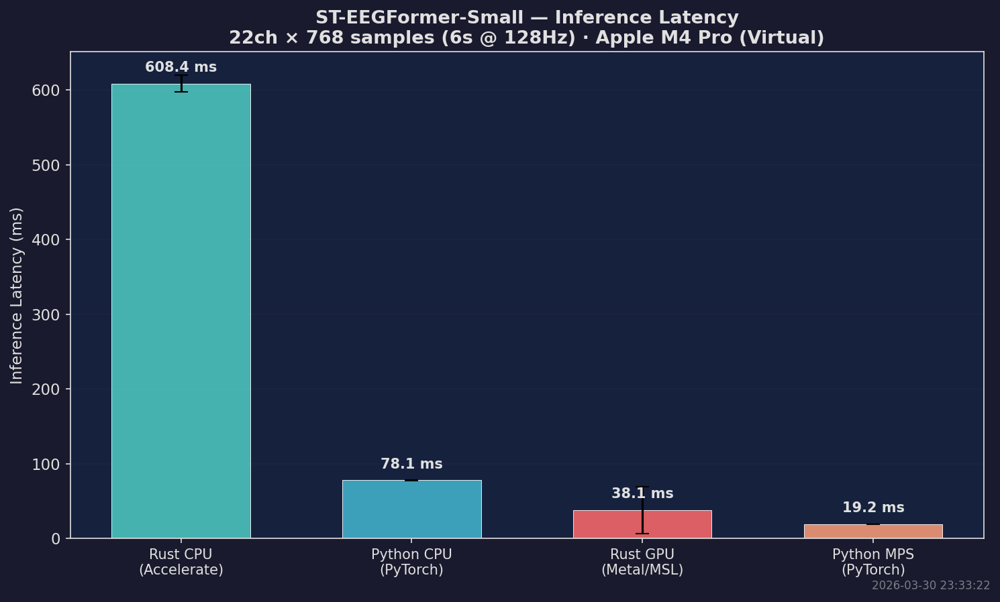
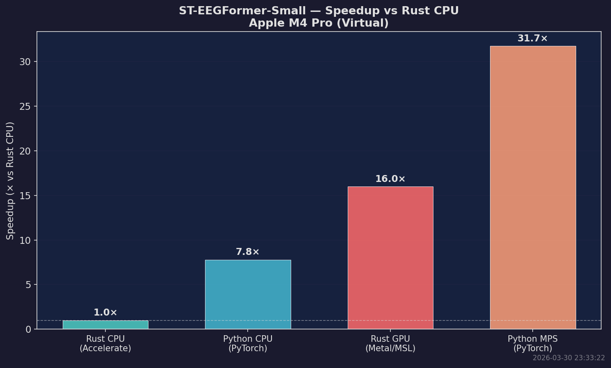
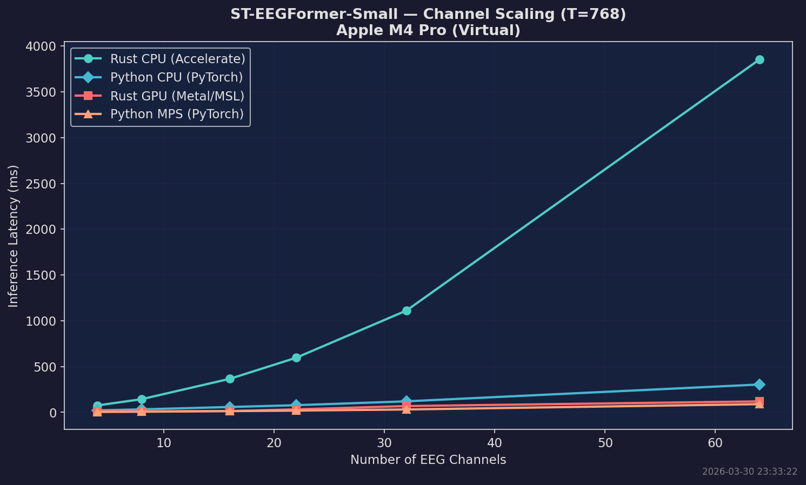
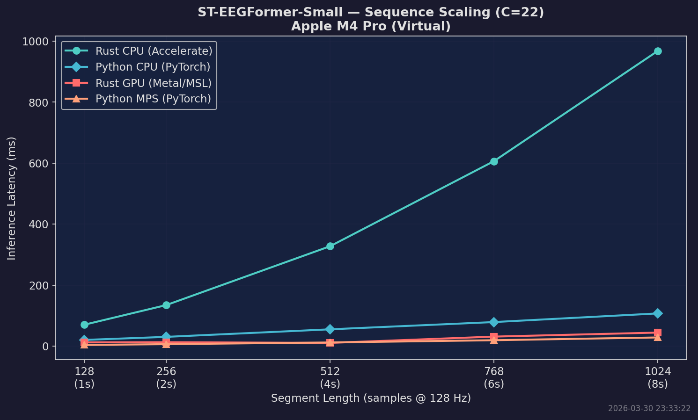
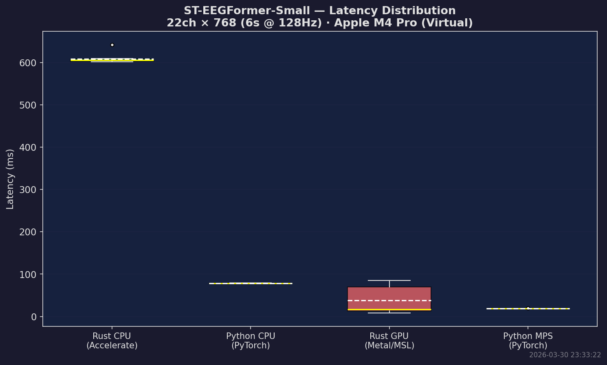

# steegformer-rs

**ST-EEGFormer** (Spatio-Temporal EEG Transformer) Foundation Model — inference in Rust with [Burn ML](https://burn.dev).

A pure-Rust implementation of the [ST-EEGFormer](https://github.com/LiuyinYang1101/STEEGFormer) model (KU Leuven), a ViT-based EEG foundation model pre-trained via Masked Autoencoder (MAE) reconstruction on raw EEG signals. Winner of the **NeurIPS 2025 EEG Foundation Challenge** (1st Place), accepted at **ICLR 2026**.

Numerical parity with the Python implementation is verified to **RMSE 0.000001** (Pearson r = 1.000000).

## Architecture

ST-EEGFormer uses a minimal, transparent ViT architecture with spatio-temporal patch tokenization:

```
EEG signal (B, C, T)   — C channels, T samples @ 128 Hz
    │
    ├─→ PatchEmbedEEG
    │     Unfold each channel into patches of 16 samples
    │     Linear(16, embed_dim)
    │     → (B, num_patches, C, embed_dim)
    │     → flatten → (B, num_patches × C, embed_dim)
    │
    ├─→ + Sinusoidal Temporal Positional Encoding (fixed, per time-patch)
    ├─→ + Learned Channel Embedding (nn.Embedding(145, D), per electrode)
    │
    ├─→ Prepend [CLS] token (+ temporal PE for position 0)
    │
    ├─→ N × Transformer Encoder Block
    │     Pre-norm: LayerNorm → Multi-Head Self-Attention → residual
    │               LayerNorm → FFN (Linear→GELU→Linear) → residual
    │
    └─→ LayerNorm → CLS token output (or global average pool)
              │
              └─→ (B, embed_dim)  — latent representation
```

### Key Design Choices

| Feature | Detail |
|---|---|
| **Input** | 128 Hz, ≤ 6s segments (768 samples), up to 142 channels |
| **Patch size** | 16 samples (0.125s temporal resolution) |
| **Temporal PE** | Fixed sinusoidal (generalizes to any segment length) |
| **Channel PE** | Learned embeddings (handles variable electrode montages) |
| **Pre-training** | MAE with 75% masking ratio |
| **Architecture** | Standard ViT (timm `Block` with qkv_bias) |

### Model Variants

| Variant | Params | Layers | Heads | embed_dim |
|---------|--------|--------|-------|-----------|
| ST-EEGFormer-Small | ~30M | 8 | 8 | 512 |
| ST-EEGFormer-Base  | ~86M | 12 | 12 | 768 |
| ST-EEGFormer-Large | ~300M | 24 | 16 | 1024 |

Pre-trained weights on [HuggingFace](https://huggingface.co/eugenehp/ST-EEGFormer) (safetensors) and [GitHub Releases](https://github.com/LiuyinYang1101/STEEGFormer/releases) (PyTorch .pth).

---

## Benchmarks

Inference benchmarks on **Apple M4 Pro** (10C/10T, 64GB RAM). All runs use ST-EEGFormer-Small (30M params), 22 EEG channels × 768 samples (6s @ 128Hz), 3 warmup + 10 timed runs.

### Inference Latency



| Backend | Mean | Min | vs Rust CPU |
|---|---|---|---|
| Rust CPU (NdArray + Accelerate) | 608.4 ms | 601.4 ms | 1.0× |
| Python CPU (PyTorch 2.6) | 78.1 ms | 77.2 ms | 7.8× |
| **Rust GPU (Burn wgpu + Metal)** | **38.1 ms** | **7.9 ms** | **16.0×** |
| Python MPS (PyTorch + Metal) | 19.2 ms | 19.0 ms | 31.7× |

### Speedup



### Channel Scaling



| Channels | Rust CPU | Python CPU | Rust GPU | Python MPS |
|---|---|---|---|---|
| 4 | 75.5 ms | 21.8 ms | 11.5 ms | 4.0 ms |
| 8 | 143.8 ms | 32.9 ms | 10.1 ms | 6.8 ms |
| 16 | 366.3 ms | 59.6 ms | 14.1 ms | 13.5 ms |
| 22 | 596.0 ms | 77.9 ms | 32.7 ms | 19.3 ms |
| 32 | 1111.5 ms | 121.3 ms | 68.7 ms | 31.3 ms |
| 64 | 3853.2 ms | 301.9 ms | 119.4 ms | 90.1 ms |

### Sequence Length Scaling



| Samples | Duration | Rust CPU | Python CPU | Rust GPU | Python MPS |
|---|---|---|---|---|---|
| 128 | 1.0s | 70.0 ms | 19.6 ms | 12.0 ms | 3.7 ms |
| 256 | 2.0s | 134.5 ms | 30.2 ms | 12.6 ms | 6.1 ms |
| 512 | 4.0s | 327.6 ms | 54.7 ms | 10.3 ms | 11.8 ms |
| 768 | 6.0s | 606.6 ms | 78.3 ms | 31.0 ms | 19.1 ms |
| 1024 | 8.0s | 968.2 ms | 108.1 ms | 44.2 ms | 28.4 ms |

### Latency Distribution



---

## Numerical Parity

Verified against the Python implementation at every stage:

| Stage | RMSE | Pearson r |
|---|---|---|
| Patch embedding | 0.000000 | 1.000000 |
| Channel embedding | 0.000000 | 1.000000 |
| Temporal encoding | 0.000000 | 1.000000 |
| After positional encoding | 0.000000 | 1.000000 |
| After CLS prepend | 0.000000 | 1.000000 |
| After transformer block 0 | 0.000004 | 1.000000 |
| **Full encoder (8 blocks)** | **0.000001** | **1.000000** |

---

## Quick Start

### Download weights

```bash
# From HuggingFace (recommended)
huggingface-cli download eugenehp/ST-EEGFormer \
    ST-EEGFormer_small_encoder.safetensors \
    config.json \
    --local-dir weights/
```

### Build

```bash
# CPU (default — NdArray + Rayon)
cargo build --release

# CPU with Apple Accelerate (macOS)
cargo build --release --features blas-accelerate

# GPU — Metal on macOS
cargo build --release --no-default-features --features metal

# GPU — Vulkan on Linux
cargo build --release --no-default-features --features vulkan
```

### Generate test data

```bash
cargo run --bin gen_sample_eeg --release
```

### Run inference

```bash
cargo run --bin infer --release -- \
  --weights model.safetensors \
  --config config.json
```

### Extract embeddings

```bash
cargo run --example embed --release -- \
  --weights model.safetensors \
  --variant small
```

### Run benchmarks

```bash
# CPU vs GPU
./bench.sh small 3 10 model.safetensors

# With Python comparison
python scripts/benchmark_python.py --checkpoint checkpoint.pth --json > bench_results/python.json
python scripts/generate_charts.py bench_results/<run_dir>/
```

---

## API Usage

```rust
use steegformer::{STEEGFormerEncoder, ModelConfig, data};
use burn::backend::NdArray as B;
use std::path::Path;

let device = burn::backend::ndarray::NdArrayDevice::Cpu;

// Load model
let cfg = ModelConfig::small();
let (encoder, ms) = STEEGFormerEncoder::<B>::load_from_config(
    cfg,
    Path::new("model.safetensors"),
    device.clone(),
)?;

// Build input from channel names
let channels = &["Fz", "C3", "C4", "Pz"];
let signal = vec![0.0f32; channels.len() * 768];
let batch = data::build_batch_named::<B>(signal, channels, 768, &device);

// Get embeddings
let result = encoder.run_batch(&batch)?;
println!("Embedding: {:?}", result.shape);  // [512] for small
```

---

## Channel Vocabulary

ST-EEGFormer uses a 142-channel vocabulary covering the extended 10-20 system and BCI-specific electrodes. Common subsets are provided:

- `STANDARD_10_20` — 19 standard channels
- `BCI_COMP_IV_2A` — 22 motor imagery channels

See `src/channel_vocab.rs` for the full mapping.

---

## Project Structure

```
src/
├── lib.rs              — Public API and re-exports
├── config.rs           — ModelConfig (small/base/large), DataConfig
├── channel_vocab.rs    — 142-channel vocabulary mapping
├── data.rs             — InputBatch construction, z-score normalization
├── encoder.rs          — High-level STEEGFormerEncoder
├── weights.rs          — Safetensors weight loading
├── model/
│   ├── steegformer.rs  — Full encoder model
│   ├── patch_embed.rs  — EEG patch embedding (unfold + linear)
│   ├── positional.rs   — Sinusoidal temporal + learned channel PE
│   ├── attention.rs    — Multi-head self-attention (qkv_bias)
│   ├── encoder_block.rs — Pre-norm transformer block
│   ├── feedforward.rs  — FFN (Linear→GELU→Linear)
│   └── norm.rs         — LayerNorm wrapper
├── bin/
│   ├── infer.rs        — CLI inference
│   ├── gen_sample_eeg.rs — Generate synthetic EEG CSV
│   └── safetensors_info.rs — Inspect weight files
scripts/
├── export_parity_vectors.py — Export Python reference tensors
├── benchmark_python.py      — Python inference benchmark
└── generate_charts.py       — Generate comparison charts
examples/
├── embed.rs            — Embedding extraction
├── reconstruct.rs      — Forward pass test
└── benchmark.rs        — Inference latency benchmark
tests/
├── forward_pass.rs     — Smoke tests (9 tests)
└── python_parity.rs    — Numerical parity tests (5 tests)
```

---

## References

- **Paper**: [Are EEG Foundation Models Worth It?](https://openreview.net/forum?id=5Xwm8e6vbh) (ICLR 2026)
- **Original code**: [LiuyinYang1101/STEEGFormer](https://github.com/LiuyinYang1101/STEEGFormer)
- **MAE**: [Masked Autoencoders Are Scalable Vision Learners](https://arxiv.org/abs/2111.06377)
- **Burn ML**: [burn.dev](https://burn.dev)

## License

Apache-2.0
